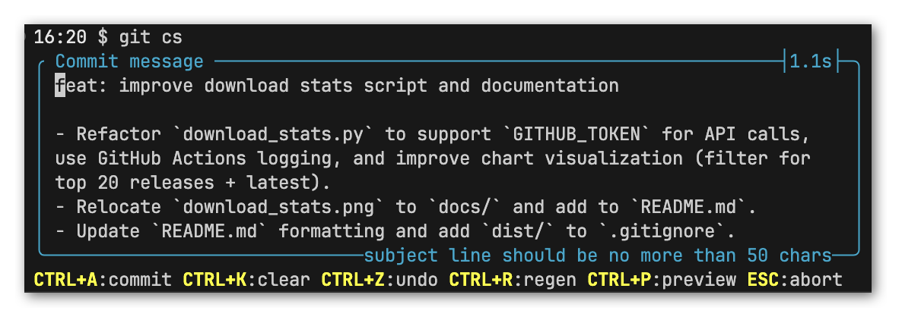
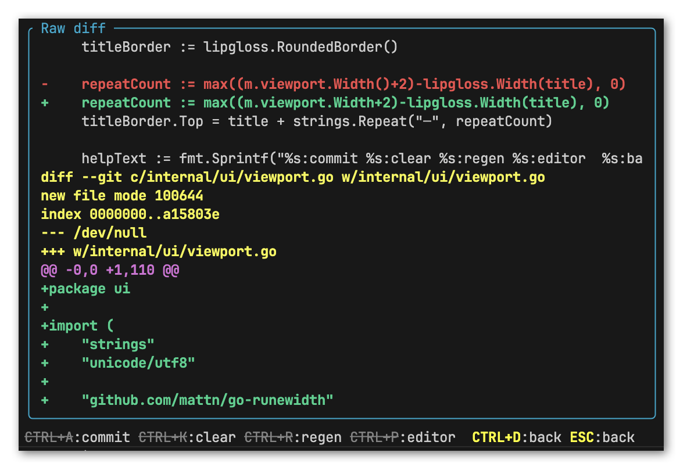
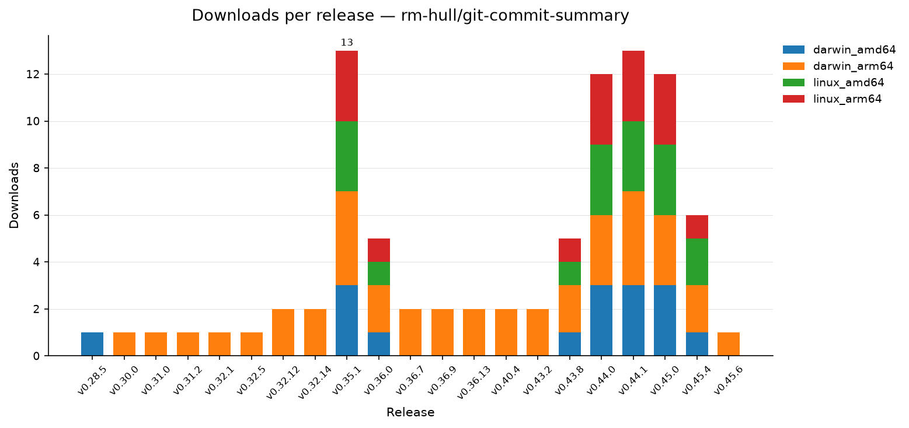

# Git Commit Summary

Tired of writing git commit messages? This tool uses AI ✨ to automatically generate a concise commit summary for your staged changes.



## Features

- **Automatic Commit Summaries:** Analyzes your staged changes and generates ~~AI-slop~~ high-quality commit messages.
- **Colorful Output:** Provides a visually appealing and easy-to-read output in your terminal.
- **Contextual Hints:** Provide additional context to the LLM via the `--hint` flag to improve relevance.
- **Git Hook Integration:** Easily install as a `prepare-commit-msg` hook to automatically generate summaries when you run `git commit`.
- **Interactive Confirmation:** Prompts you to confirm the commit message before committing.
- **Auto-completion:** Supports shell auto-completion for flags in Bash and Zsh.
- **Multiple LLM Providers:** Supports Google Gemini, OpenAI, OpenRouter, and local Llama.cpp instances.
- **Exclusion Lists:** Easily ignore specific files or patterns via `.gitcommitsummaryignore` files.
- **Raw Diff View:** Quickly review your staged changes with a colored diff directly within the editor.
- **Setup Wizard:** Easy configuration with an interactive setup wizard.



## Installation

If you have [homebrew](https://brew.sh/), you can first add this tap to your Homebrew installation:

```bash
brew tap rm-hull/tap
```

Then you can install with:

```bash
brew install git-commit-summary
```

> [!NOTE]
> Alternatively, if you have the [golang](https://go.dev/doc/install) toolchain, you can install with:
>
> ```bash
> go install github.com/rm-hull/ git-commit-summary@latest
> ```

Ensure that the executable is on your `$PATH`. You can verify this by running `git-commit-summary --version`.

## Setup

The easiest way to configure `git-commit-summary` is by using the built-in setup wizard:

```bash
git commit-summary --setup-wizard
```

This will guide you through selecting an LLM provider, choosing a model, and entering your API key. The configuration is stored in an XDG-compliant location (e.g., `~/.config/git-commit-summary/config.env`).

### Manual Configuration

If you prefer to configure the tool manually, you can create or edit the `config.env` file in your XDG config home directory:

- **Linux**: `~/.config/git-commit-summary/config.env`
- **MacOS**: `~/Library/Application Support/git-commit-summary/config.env`
- **Windows**: `%USERPROFILE%\.config\git-commit-summary\config.env`

You can also use a `.env` file in your git repository root for project-specific overrides.

#### Supported Providers

| Provider          | Environment Variables                                                                               |
| :---------------- | :-------------------------------------------------------------------------------------------------- |
| **Google Gemini** | `LLM_PROVIDER="google"`, `GEMINI_API_KEY`, `GEMINI_MODEL` (default: `gemini-3-flash-preview`)       |
| **OpenAI**        | `LLM_PROVIDER="openai"`, `OPENAI_API_KEY`, `OPENAI_MODEL` (default: `gpt-4o`)                       |
| **OpenRouter**    | `LLM_PROVIDER="openrouter"`, `OPENROUTER_API_KEY`, `OPENROUTER_MODEL`                               |
| **Llama.cpp**     | `LLM_PROVIDER="llama.cpp"`, `LLAMACPP_BASE_URL`, `LLAMACPP_MODEL`, `LLAMACPP_API_KEY` (if required) |

#### Local Llama.cpp Example

To point to a local [llama.cpp](https://github.com/ggml-org/llama.cpp) service, use the following config:

```
LLM_PROVIDER="llama.cpp"
LLAMACPP_BASE_URL="http://localhost:8080/v1"
LLAMACPP_MODEL="Meta-Llama-3.1-8B-Instruct-Q4_K_M"
```

## Usage

1.  **Stage your changes:**

    ```bash
    git add <files>
    ```

2.  **Run the tool:**

    ```bash
    git commit-summary
    ```

3.  **Confirm the commit:**
    The tool will display the generated commit summary. Use the following shortcuts to interact with it:
    - `CTRL+A`: Accept and commit
    - `CTRL+R`: Reprompt & regenerate the commit message
    - `CTRL+K`: Clear the generated commit message
    - `CTRL+X`: Cut line and copy to clipboard
    - `CTRL+P`: Toggle preview mode
    - `CTRL+D`: View raw colored diff of staged changes
    - `ESC`: Abort

## Flags

| Flag               | Shorthand | Description                                                           |
| :----------------- | :-------- | :-------------------------------------------------------------------- |
| `--all`            | `-a`      | Add all tracked files to the commit                                   |
| `--bash`           |           | Generate bash completion script                                       |
| `--help`           | `-h`      | Show help                                                             |
| `--hint`           | `-H`      | Provide contextual guidance for the commit summary generation         |
| `--install-hook`   |           | Install as a `prepare-commit-msg` hook in the current repository      |
| `--llm-provider`   |           | Override the `LLM_PROVIDER` environment variable                      |
| `--message`        | `-m`      | Append a message to the commit summary                                |
| `--no-verify`      |           | Bypass pre-commit and commit-msg hooks                                |
| `--setup-wizard`   |           | Run the interactive setup wizard                                      |
| `--skip-ci`        |           | Append `[skip ci]` to the first line of the commit message to skip CI |
| `--uninstall-hook` |           | Remove the `prepare-commit-msg` hook from the current repository      |
| `--version`        | `-v`      | Display version                                                       |
| `--yolo`           |           | Commit immediately without asking for confirmation                    |
| `--zsh`            |           | Generate zsh completion script                                        |

## Ignoring Files

You can exclude specific files or patterns from analysis by creating a `.gitcommitsummaryignore` file. For more details, see [docs/exclusions.md](./docs/exclusions.md).

## Git Alias

Add an alias to your `~/.gitconfig` for faster access:

```bash
git config --global alias.cs commit-summary
```

Now you can just run `git cs`.

## Auto-completion

`git-commit-summary` supports shell auto-completion for flags.

### Bash

To enable auto-completion for the current session, run:

```bash
. <(git-commit-summary --bash)
```

To make it permanent, add the above line to your `~/.bashrc` or `~/.bash_profile`.

### Zsh

To enable auto-completion for the current session, run:

```bash
source <(git-commit-summary --zsh)
```

To make it permanent, add the above line to your `~/.zshrc`.

## Stats



## License

This project is licensed under the MIT License - see the [LICENSE.md](LICENSE.md) file for details.
